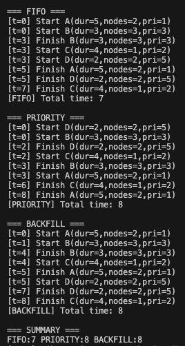

# Cluster Simulator

Небольшая программа, которая показывает, как один и тот же набор задач ведёт себя при трёх разных способах планирования на кластере.

## Как запустить
1. Установите Python 3.10+.
2. (Опционально) создайте виртуальное окружение: `python -m venv venv && source venv/bin/activate`.
3. Выполните `python cluster.py` — в терминале появится лог работы всех стратегий.

## Что тут происходит
- `Job` описывает задачу: имя, сколько тиков она занимает, сколько узлов ей нужно и какой у неё приоритет. Поле `remaining` показывает, сколько времени осталось.
- `Cluster` хранит общее количество узлов, следит за тем, какие задачи уже запущены, и умеет освобождать ресурсы, когда задача заканчивается.
- Метод `tick()` двигает время вперёд на один шаг: уменьшает `remaining` у каждого запущенного задания и возвращает узлы тем, кто закончился.
- В конце файла лежит список `base_jobs` и число `total_nodes`. Их можно менять, чтобы проверить другие сценарии.

## Алгоритмы
- **FIFO** — запускаем задачи строго по порядку. Если первой не хватает узлов, ждём, пока освободятся.
- **Priority** — задачи лежат в куче по приоритету, всегда пытаемся запустить самую важную из тех, что помещаются.
- **Backfill** — очередь всё ещё FIFO, но если первая не помещается, пробуем воткнуть короткие задачи из хвоста, пока ждём.

## Что печатает программа
- В логе видно, когда задача стартовала и когда завершилась: например, `[t=2] Start A` или `[t=5] Finish C`.
- После каждого алгоритма выводится его общее время, а в конце — таблица `SUMMARY` для сравнения.

## Пример вывода

